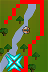

# Shortest Path

## Info
Draws the shortest path to a chosen destination on the map (right click a spot on the world map or shift right click a tile to use).

## Config options
- Settings
  - Avoid wilderness: ✅ `true`
    - Whether the wilderness should be avoided if possible (otherwise, will suggest using wilderness lever to travel from Edgeville to Ardougne)
  - Use agility shortcuts: ✅ `true`
    - Whether to include agility shortcuts in the path. You must also have the required agility level
  - Use grapple shortcuts: ⬜️ `false`
    - Whether to include crossbow grapple agility shortcuts in the path. You must also have the required agility, ranged and strength levels
  - Use boats: ✅ `true`
    - Whether to include boats in the path (e.g. the boat to Fishing Platform)
  - Use canoes: ⬜️ `false`
    - Whether to include canoes in the path
  - Use charter ships: ⬜️ `false`
    - Whether to include charter ships in the path
  - Use ships: ✅ `true`
    - Whether to include passenger ships in the path (e.g. the customs ships to Karamja)
  - Use fairy rings: ✅ `true`
    - Whether to include fairy rings in the path
  - Use gnome gliders: ✅ `true`
    - Whether to include gnome gliders in the path
  - Use spirit trees: ✅ `true`
    - Whether to include spirit trees in the path
  - Use teleportation levers: ✅ `true`
    - Whether to include teleportation levers in the path (e.g. the lever from Edgeville to Wilderness)
  - Use teleportation portals: ✅ `true`
    - Whether to include teleportation portals in the path (e.g. the portal from Ferox Enclave to Castle Wars)
  - Cancel instead of recalculating: ⬜️ `false`
    - Whether the path should be cancelled rather than recalculated when the distance limit is exceeded
  - Recalculate distance: `10`
    - Distance from the path the player should be for it to be recalculated (-1 for never)
  - Finish distance: `5`
    - Distance from the target tile at which the path should be ended (-1 for never)
  - Show tile counter: `Disabled`
    - Whether to display the number of tiles travelled, number of tiles remaining or disable counting
  - Tile counter step: `1`
    - The number of tiles between the displayed tile counter numbers
  - Calculation cutoff: `5`
    - The cutoff threshold in number of ticks (0.6 seconds) of no progress being made towards the path target before the calculation will be stopped
- Display
  - Draw path on world map: ✅ `true`
    - Whether the path should be drawn on the world map
  - Draw path on minimap: ✅ `true`
    - Whether the path should be drawn on the minimap
  - Draw path on tiles: ✅ `true`
    - Whether the path should be drawn on the game tiles
  - Draw transports: ⬜️ `false`
    - Whether transports should be drawn
  - Draw collision map: ⬜️ `false`
    - Whether the collision map should be drawn
  - Path style: `Tiles`
    - Whether to display the path as tiles or a segmented line
- Colours
  - Path: `#FFFF0000`
    - Colour of the path tiles on the world map, minimap and in the game scene
  - Calculating: `#FF0000FF`
    - Colour of the path tiles while the pathfinding calculation is in progress
  - Transports: `#8000FF00`
    - Colour of the transport tiles
  - Collision map: `#800080FF`
    - Colour of the collision map tiles
  - Text: `#FFFFFFFF`
    - Colour of the text of the tile counter and fairy ring codes
